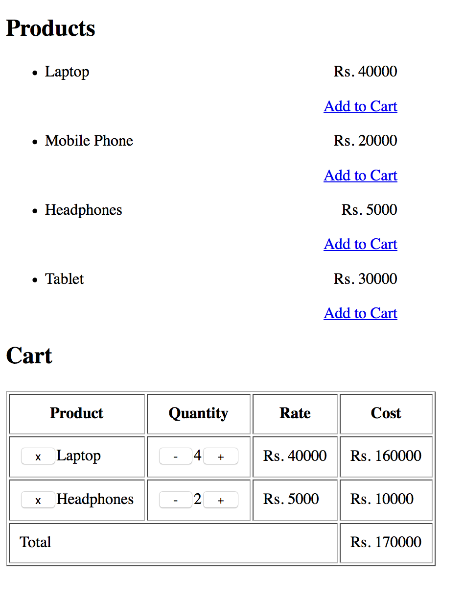

#Product List

The product list should have 3-4 (not too more) products listed with their prices shown.
Each product should have a "Add to cart" link/button to add it to the cart

#Cart

The cart should show each product added to cart, with their rates, quantity and total price.
Each product's quantity can be increased/decreased.
A "x" button in front of the product should allow deleting a product from the list.
The total of all amounts from the cart should be shown at the bottom row.
The cart's data should persist even if user refreshes browser.
